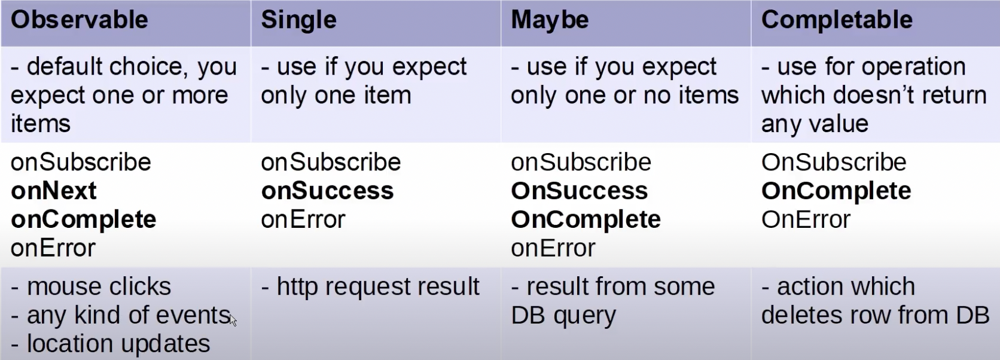

# rxandroid-example
## RxJava
- 其他背景操作，例如：AsyncTask，為不同非同步服務編寫類別、 code可讀性較差。  
- 可讀性較高，方便操作、呼叫連貫的背景步驟

## Reference
- class、function解釋 http://reactivex.io/RxJava/javadoc/overview-summary.html
- blog: https://kurtisnusbaum.medium.com/rxandroid-basics-part-1-c0d5edcf6850
  - github: https://github.com/klnusbaum/rxandroidexamples
- 名詞解釋: https://blog.csdn.net/LucasXu01/article/details/105279367
- 背壓策略: https://blog.csdn.net/qq_38499859/article/details/81747334

## 名詞解釋
- 基礎類別：
  - io.reactivex.Flowable：发送0个N个的数据，支持Reactive-Streams和背压
  - io.reactivex.Observable：发送0个N个的数据，不支持背压，
  - io.reactivex.Single：只能发送单个数据或者一个错误
  - io.reactivex.Completable：没有发送任何数据，但只处理 onComplete 和 onError 事件。
  - io.reactivex.Maybe：能够发射0或者1个数据，要么成功，要么失败。
  - 一般使用方式可以參考下圖
      
  
- 調度scheduler控制線程
  - 以下兩個方法的位置很重要，可被調用多次，每次調用可覆蓋先前的調用  
  
  - subscribeOn 
    - 訂閱的可觀察者，在指定的scheduler上，執行操作
    - 為它”以上“的上流，設置線程，以相反的順序應用
    - 可使用doOnSubscribe，讓其裡面的運作在subscribeOn
    - Subjects don't work with subscribeOn
    - 有些methods有預設Scheduler，
      ex. interval預設subscribeOn(Schedulers.computation())，也是在背景執行的thread

  - observeOn 
    - 在該線程上，callback接收觀察到的資料
    - 為它”以下“的下流回調，設置線程
  
- 背壓策略：
  - error， 緩衝區大概在128
  - buffer， 緩衝區在1000左右
  - drop， 把存不下的事件丟棄
  - latest， 只保留最新的
  - missing, 缺省設置，不做任何操作

- CompositeDisposable提供的方法中，都是對事件的管理
  - dispose():釋放所有事件
  - clear():釋放所有事件，實現同dispose()
  - add():增加某個事件
  - addAll():增加所有事件
  - remove():移除某個事件並釋放
  - delete():移除某個事件

- Subscription - 在觀察者會傳入onSubscribe(Subscription s)
  ```
  public interface Subscription {
    public void request(long n);
    public void cancel();
  }
  ```  
  - 可取消訂閱
  - 可請求上游的數據
  - 在Observer接口中，onSubscribe(Disposable d)，和上者差不多
    
## 範例
- Example 1: The Basics
  - Observables - 可觀察的(對象)
    - Observables are primarily defined by their behavior upon subscription.
      Observables的行為由訂閱來決定
    - Observable.just(value)：產生一個Observable，立即傳出value
  - Observer - 觀察者，觀察Observable
  - Subscriber - 是Observer的一个特殊实现
  - subscribe - 訂閱觀察者
  - onNext() - 收到emit的值
  - onCompleted() - 沒有值可以接收時
    
- Example 2: Asynchronous Loading 
  - Observable.fromCallable() - 使用Callable物件，接收非同步的資料
  - Scheduler as a separate thread for doing work
    Scheduler表示各自不同的線程
  - A Subscription represents a connection between an Observer and an Observable  
    訂閱代表觀察者和可觀察對象的連結  
    因為非同步操作，在結束App要取消未結束的訂閱，否則會發生memory leaks and NullPointerExceptions.  
    unsubscribe時，要先判斷；訂閱是否為null，是否狀態為退訂閱(isUnsubscribed())  
    
- Example 3: Using Singles
  - Single：簡易版的Observable，only three callbacks: onSubscribe(s: Subscription?), onSuccess() and onError()，當回傳值較不複雜可使用
  - SingleSubscriber：作為訂閱者
  - Maybe：較Single多了一個callback: onComplete()

- Example 4: Subjects
  - Subject  
    both an Observable and an Observer
    onNext(value) be called multiple times, every time a new value is emitted.
    可以呼叫onNext(value)帶入值發出，並讓Observer在onNext()接收值
  
  - Subject也分很多種類型，有不同功能就不一一舉例，ex. BehaviorSubject, RelaySubject...

- Example 5: map()
  - map(): Observer發出的資料，透過map轉換後改變資料和型態
  - 還有許多operator就不一一顯示範例，ex. filter, conditional...
  - 結合Observables的operator，ex. 
    - mergeWith: A.mergeWith(B)
    - zipWith: A.zipWith(B, { ... }) 結合後返回新的資料型態，而A、B的資料結合時是同時在同個時間軸一起發出資料
  - 功能性的operator, ex.
    - 在中間穿插操作，doOnNext{item -> ...}
    - onErrorReturnItem(value)，若上流發生錯誤則傳遞value給下游
      - intervalRange(0, TEST_NUM, 0, 500, TimeUnit.MILLISECONDS)  // 週期性接收數據
    - throttleLast(1, TimeUnit.SECONDS)  // 1秒内有新数据则抛弃旧数据
    - ...很多operators
    - 可以自訂operator，使用.list(自訂operator())，而自訂義的operator實現onNext, onError, onComplete

- Example 6: Bringing it All Together
  ```
         |  
         |  
         V  
      debounce
        |||
        |||
         V
        map
         |
         |
         V
      observer
  ```
  - The | represents emissions happening on the UI Thread and the ||| represents emissions happening on the IO Scheduler.
  - debounce(milliseconds) - only emit the last value that came into it after nothing new has come into the mSearchResultsSubject for _ milliseconds.  
    避免不必要的call function，UI不斷的更新  
    debounce(...)後為observeOn(Scheduler.IO)  
    need to observe the emissions of debounce on the IO Scheduler.  
    map(...)和subscribe()之間為observeOn(AndroidSchedulers.mainThread())  
    因為原本map執行在IO，要將emissions排放量顯示在主線程

- Example 7: Flowable
  - 第一個範例，使用Observable讓主線程處理每次收到的資料onNext(t)，一次產生錯誤
    ```
      com.example.rxandroid_example E/AndroidRuntime: FATAL EXCEPTION: main
      Process: com.example.rxandroid_example, PID: 27227
      java.lang.OutOfMemoryError: OutOfMemoryError thrown while trying to throw OutOfMemoryError; no stack trace available
    ```

  - 第二個範例，使用Flowable，可以觀察到Buffer大小為128，之後依據BackPressureStrategy處理資料

- Example 8: Cold & Hot Observable
  - 在觀察同一個Observable，使用ConnectableObservable，會以第一個觀察對象開始傳出資料
  - 當第二個以後的觀察者觀察ConnectableObservable，則會觀察到，持續傳遞的資料

- Example 9: Cold & Hot Observable
  - 在觀察同一個Observable，使用ConnectableObservable，會以第一個觀察對象開始傳出資料
  - 當第二個以後的觀察者觀察ConnectableObservable，則會觀察到，持續傳遞的資料
